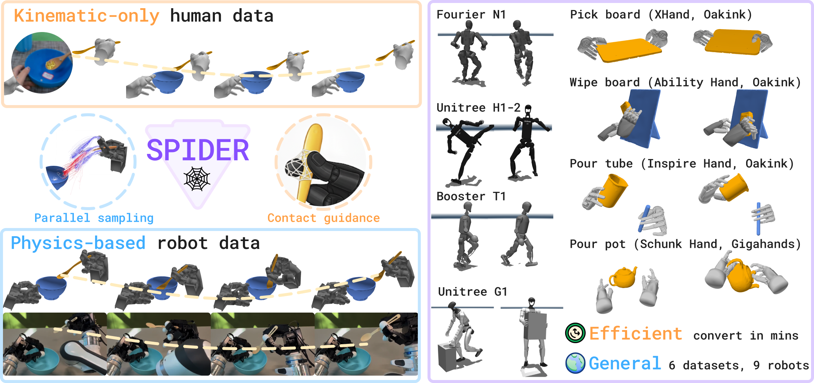
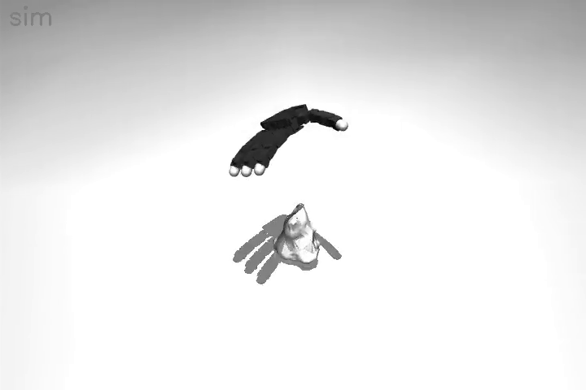
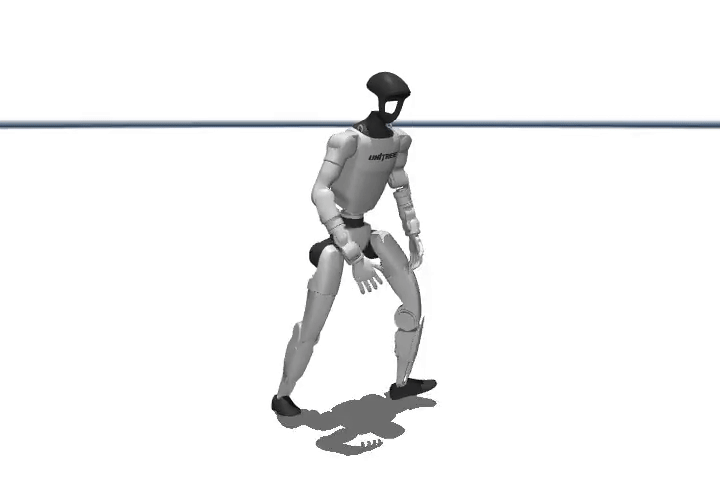
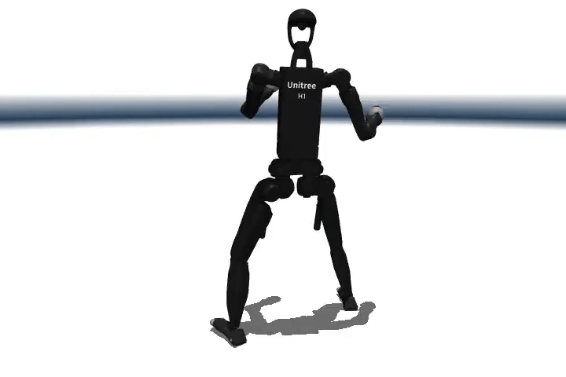
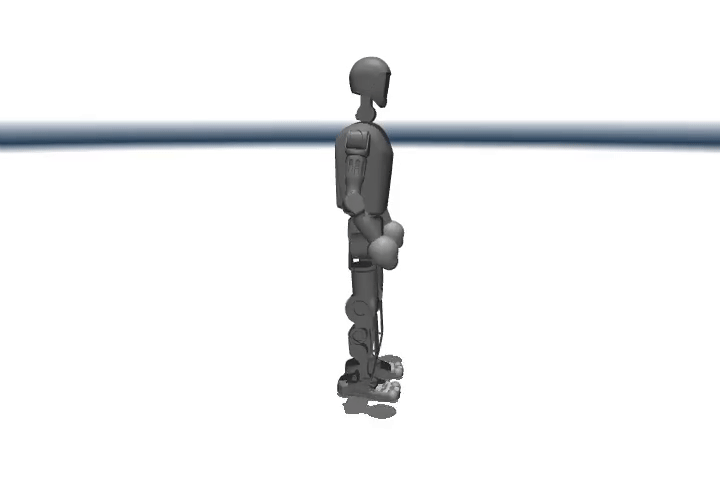
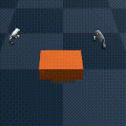
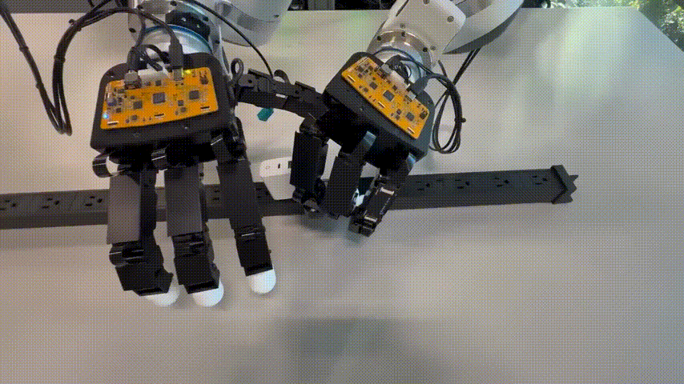
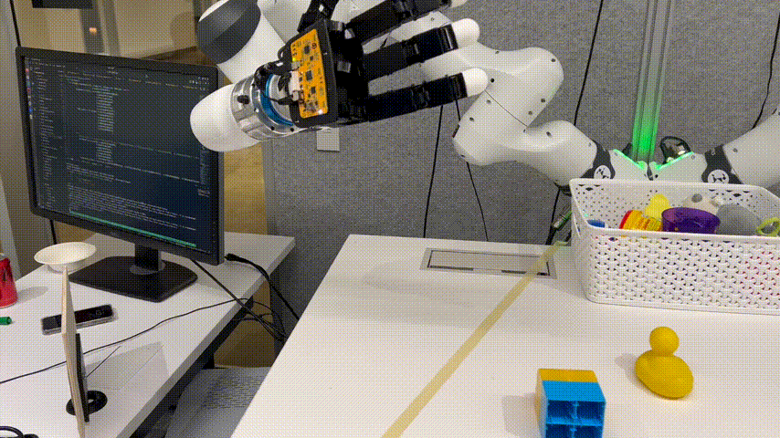

# 🚧 This repository is under internal review. Estimated release date: Nov 27 - Dec 10.

<h1 align="center">🕸️ SPIDER: Scalable Physics-Informed DExterous Retargeting</h1>

<p align="center">
  <a href="https://opensource.org/licenses/MIT">
    
  </a>
  <a href="https://www.python.org/downloads/">
    
  </a>
  <a href="https://pytorch.org/">
    
  </a>
  <a href="http://arxiv.org/abs/2511.09484">
    
  </a>
  <a href="https://jc-bao.github.io/spider/">
    
  </a>
  <a href="https://jc-bao.github.io/spider-project/">
    
  </a>
</p>



## Overview

Scalable Physics-Informed DExterous Retargeting (SPIDER) is a general framework for physics-based retargeting from human to diverse robot embodiments, including both dexterous hand and humanoid robot.
It is designed to be a minimum, flexible and extendable framework for human2robot retargeting.
This code base provides the following pipeline from human video to robot actions:


## Gallery

### Simulation results:

| Inspire Pick Tea Pot (Gigahands Dataset) | Xhand Play Glass (Hot3D dataset) | Schunk Pick Board (Oakink dataset) | Allegro Pick Cat Toy (Reconstructed from single RGB video)
| ------- | ------- | ------- | ------- |
|  |  |  |  |


| G1 Pick | G1 Run | H1 Kick | T1 skip |
| ------- | ------- | ------- | ------- |
|  |  |  |  |


### Multiple viewer support:
| Mujoco | Rerun |
| ------- | ------- |
|  |  |


### Multiple simulators support:

| Genesis | Mujoco Warp |
| ------- | ------- |
|  |  |

### Deployment to real-world robots:

| Pick Cup | Rotate Bulb | Unplug Charger | Pick Duck |
| ------- | ------- | ------- | ------- |
|  |  |  |  |


## Features

- First general **physics-based** retargeting pipeline for both dexterous hand and humanoid robot.
- Supports 9+ robots and 6+ datasets out of the box.
- Seemless integration with RL training and data augmentation for BC pipeline.
- Native support for multiple simulators (Mujoco Wrap, Genesis) and multiple downstream training pipelines (HDMI, DexMachina).
- Sim2real ready.


## Citation

```bibtex
@misc{pan2025spiderscalablephysicsinformeddexterous,
      title={SPIDER: Scalable Physics-Informed Dexterous Retargeting},
      author={Chaoyi Pan and Changhao Wang and Haozhi Qi and Zixi Liu and Homanga Bharadhwaj and Akash Sharma and Tingfan Wu and Guanya Shi and Jitendra Malik and Francois Hogan},
      year={2025},
      eprint={2511.09484},
      archivePrefix={arXiv},
      primaryClass={cs.RO},
      url={https://arxiv.org/abs/2511.09484},
}
```
