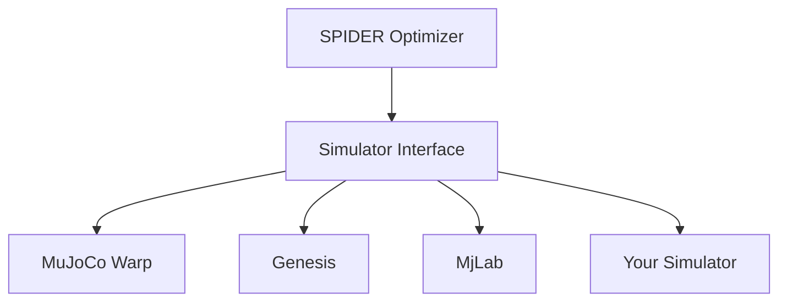

# Add New Simulator / Environment

This guide explains how to integrate a new physics simulator with SPIDER, enabling physics-based retargeting with different simulation backends.

## Overview

SPIDER is designed to work with any simulator out of the box. The modular architecture allows you to port new simulators by implementing a standard interface.

**Current simulators:**
- **MJWP**: MuJoCo + Warp (default)
- **DexMachina**: Genesis simulator
- **HDMI**: MjLab (MuJoCo fork)

**This guide covers:**
- Required interface functions
- Implementation steps
- Configuration setup
- Testing and debugging

## Architecture



The simulator interface provides a standardized API that SPIDER's optimizer uses, regardless of the underlying physics engine.

## Required Interface

### Core Functions (Required)

These functions are essential for SPIDER optimization:

#### 1. `setup_env(config, ref_data)`

Initialize and return the environment instance.

```python
def setup_env(config: Config, ref_data: tuple | None) -> Any:
    """
    Setup simulation environment.

    Args:
        config: SPIDER configuration
        ref_data: Reference trajectory data (qpos, qvel, ctrl, contact, contact_pos)
                  or None if environment provides its own reference

    Returns:
        Environment instance (simulator-specific type)
    """
    # Initialize your simulator
    env = YourSimulator(
        num_envs=config.num_samples,
        device=config.device,
        dt=config.sim_dt,
    )

    # Load scene/model
    env.load_scene(config.model_path)

    # Set initial state
    if ref_data is not None:
        qpos_ref, qvel_ref, _, _, _ = ref_data
        env.set_state(qpos_ref[0], qvel_ref[0])

    return env
```

#### 2. `step_env(config, env, ctrl)`

Step the simulator with control inputs.

```python
def step_env(config: Config, env: Any, ctrl: torch.Tensor) -> None:
    """
    Step simulation forward with controls.

    Args:
        config: SPIDER configuration
        env: Environment instance
        ctrl: Control inputs [num_samples, nu]
    """
    # Apply controls
    env.set_action(ctrl)

    # Step physics
    env.step()
```

#### 3. `save_state(env)`

Save the current state of all parallel environments.

```python
def save_state(env: Any) -> dict:
    """
    Save current simulation state.

    Args:
        env: Environment instance

    Returns:
        State dictionary (simulator-specific format)
    """
    return {
        'qpos': env.get_qpos().clone(),
        'qvel': env.get_qvel().clone(),
        # Add any other state needed for perfect restoration
        'time': env.time,
    }
```

#### 4. `load_state(env, state)`

Load a saved state back into the environments.

```python
def load_state(env: Any, state: dict) -> None:
    """
    Restore simulation state.

    Args:
        env: Environment instance
        state: State dictionary from save_state()
    """
    env.set_qpos(state['qpos'])
    env.set_qvel(state['qvel'])
    env.time = state['time']
```

#### 5. `get_reward(config, env, ref)`

Compute reward for current state.

```python
def get_reward(config: Config, env: Any, ref: tuple) -> torch.Tensor:
    """
    Compute reward for current state.

    Args:
        config: SPIDER configuration
        env: Environment instance
        ref: Reference data (qpos_ref, qvel_ref, ctrl_ref, contact, contact_pos)

    Returns:
        Rewards [num_samples]
    """
    qpos_ref, qvel_ref, ctrl_ref, contact, contact_pos = ref
    qpos = env.get_qpos()
    qvel = env.get_qvel()

    # Tracking reward
    pos_error = torch.norm(qpos - qpos_ref, dim=-1)
    vel_error = torch.norm(qvel - qvel_ref, dim=-1)

    reward = -pos_error * config.joint_rew_scale
    reward += -vel_error * config.vel_rew_scale

    return reward
```

#### 6. `get_terminal_reward(config, env, ref_slice)`

Compute terminal reward with scaling.

```python
def get_terminal_reward(
    config: Config,
    env: Any,
    ref_slice: tuple
) -> torch.Tensor:
    """
    Compute terminal (final state) reward.

    Args:
        config: SPIDER configuration
        env: Environment instance
        ref_slice: Reference slice for horizon

    Returns:
        Terminal rewards [num_samples]
    """
    # Often just scaled version of regular reward
    reward = get_reward(config, env, ref_slice[-1])
    return reward * config.terminal_rew_scale
```

### Helper Functions (Required for Optimizer)

#### 7. `get_trace(config, env)`

Return visualization trace points.

```python
def get_trace(config: Config, env: Any) -> torch.Tensor:
    """
    Get trace points for visualization.

    Args:
        config: SPIDER configuration
        env: Environment instance

    Returns:
        Trace positions [num_samples, num_traces, 3]
    """
    # Get positions of trace sites (hands, feet, objects, etc.)
    traces = []

    for site_id in config.trace_site_ids:
        site_pos = env.get_site_position(site_id)
        traces.append(site_pos)

    return torch.stack(traces, dim=1)  # [num_samples, num_traces, 3]
```

#### 8. `save_env_params(config, env)`

Save environment parameters for domain randomization.

```python
def save_env_params(config: Config, env: Any) -> dict:
    """
    Save environment parameters (for domain randomization).

    Args:
        config: SPIDER configuration
        env: Environment instance

    Returns:
        Parameters dictionary
    """
    return {
        'object_pos': env.get_object_position().clone(),
        'object_mass': env.get_object_mass().clone(),
        'friction': env.get_friction().clone(),
        # Add any randomized parameters
    }
```

#### 9. `load_env_params(config, env, env_param)`

Load environment parameters.

```python
def load_env_params(config: Config, env: Any, env_param: dict) -> None:
    """
    Load environment parameters.

    Args:
        config: SPIDER configuration
        env: Environment instance
        env_param: Parameters from save_env_params()
    """
    env.set_object_position(env_param['object_pos'])
    env.set_object_mass(env_param['object_mass'])
    env.set_friction(env_param['friction'])
```

#### 10. `sync_env(config, env)`

Synchronize state across parallel environments.

```python
def sync_env(config: Config, env: Any) -> None:
    """
    Synchronize state across parallel environments.
    Typically broadcasts first environment to all others.

    Args:
        config: SPIDER configuration
        env: Environment instance
    """
    # Get state from first environment
    qpos = env.get_qpos()
    qvel = env.get_qvel()

    # Broadcast to all environments
    qpos_sync = qpos[0:1].repeat(config.num_samples, 1)
    qvel_sync = qvel[0:1].repeat(config.num_samples, 1)

    env.set_qpos(qpos_sync)
    env.set_qvel(qvel_sync)
```

### Optional Functions

#### `copy_sample_state(state, sample_idx)`

Copy state from specific sample (for best trajectory selection).

```python
def copy_sample_state(state: dict, sample_idx: int) -> dict:
    """
    Copy state from specific parallel environment.

    Args:
        state: Full state dictionary
        sample_idx: Index of sample to copy

    Returns:
        State dictionary for single sample
    """
    return {
        'qpos': state['qpos'][sample_idx:sample_idx+1].clone(),
        'qvel': state['qvel'][sample_idx:sample_idx+1].clone(),
        'time': state['time'],
    }
```

#### `get_terminate(config, env, ref)`

Early termination check (optional optimization).

```python
def get_terminate(config: Config, env: Any, ref: tuple) -> torch.Tensor:
    """
    Check if rollout should terminate early.

    Args:
        config: SPIDER configuration
        env: Environment instance
        ref: Reference data

    Returns:
        Boolean mask [num_samples]
    """
    # Example: terminate if object falls
    object_height = env.get_object_position()[:, 2]
    terminate = object_height < 0.1

    return terminate
```
