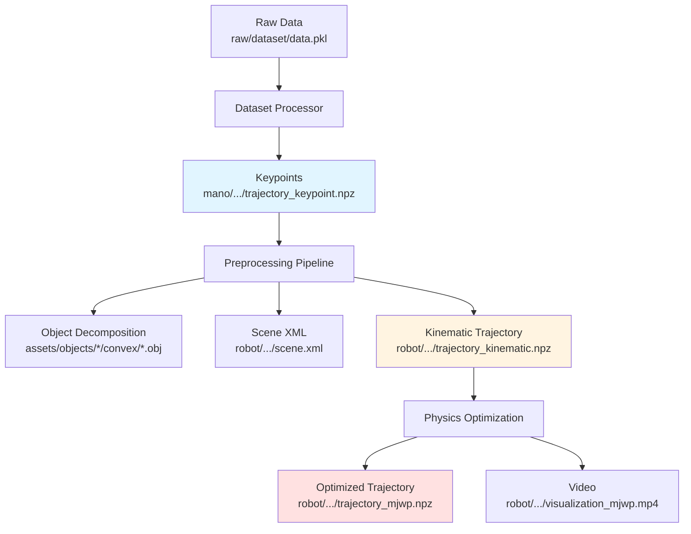

# Data Structure

SPIDER uses a structured file organization to handle multiple datasets, robots, and tasks efficiently.

## Directory Layout

```
example_datasets/
├── raw/                          # Raw human motion data
│   └── {dataset_name}/
│       ├── {data_id}.pkl
│       └── meshes/
│
└── processed/                    # Processed robot trajectories
    └── {dataset_name}/
        ├── dataset_summary.json  # High-level metadata
        ├── assets/               # Shared assets (avoid duplication)
        │   ├── objects/
        │   └── robots/
        ├── mano/                 # Extracted human hand data
        │   └── {embodiment_type}/
        │       └── {task}/
        │           └── {data_id}/
        │               ├── trajectory_keypoint.npz
        │               └── info.json
        └── {robot_type}/         # Robot-specific data
            └── {embodiment_type}/
                └── {task}/
                    └── {data_id}/
                        ├── scene.xml
                        ├── trajectory_kinematic.npz
                        ├── trajectory_mjwp.npz
                        ├── visualization_mjwp.mp4
                        └── metrics.json
```

## Path Resolution

SPIDER automatically resolves paths based on task parameters:

```python
from spider.io import get_processed_data_dir

# Resolve processed directory
processed_dir = get_processed_data_dir(
    dataset_dir="/path/to/datasets",
    dataset_name="oakink",
    robot_type="allegro",
    embodiment_type="bimanual",
    task="pick_spoon_bowl",
    data_id=0
)
# Returns: /path/to/datasets/processed/oakink/allegro/bimanual/pick_spoon_bowl/0/
```

## File Formats

### Raw Data (`raw/{dataset_name}/{data_id}.pkl`)

Raw human motion data from dataset processing:

```python
{
    'qpos_wrist_right': np.ndarray,    # [T, 7] position + quaternion
    'qpos_finger_right': np.ndarray,   # [T, n_joints] joint angles
    'qpos_wrist_left': np.ndarray,     # [T, 7]
    'qpos_finger_left': np.ndarray,    # [T, n_joints]
    'qpos_obj_right': np.ndarray,      # [T, 7] object pose
    'qpos_obj_left': np.ndarray,       # [T, 7]
    'contact': np.ndarray,             # [T, ncon] contact indicators
    'contact_pos': np.ndarray          # [T, ncon, 3] contact positions
}
```

### Trajectory Files (`.npz`)

#### `trajectory_keypoint.npz`

Human hand keypoints (from dataset processor):

```python
{
    'qpos_wrist_right': [T, 7],
    'qpos_finger_right': [T, 15],
    'qpos_obj_right': [T, 7],
    # ... left hand equivalents
}
```

#### `trajectory_kinematic.npz`

Kinematic retargeting result (from IK):

```python
{
    'qpos': [T, nq],      # Full robot configuration
    'qvel': [T, nv],      # Velocities
    'ctrl': [T, nu],      # Control targets
    'contact': [T, ncon], # Contact indicators
    'contact_pos': [T, ncon, 3]  # Contact positions
}
```

#### `trajectory_mjwp.npz`

Physics-optimized trajectory (from MJWP):

```python
{
    'qpos': [N_steps, ctrl_steps, nq],  # Per-step configs
    'qvel': [N_steps, ctrl_steps, nv],  # Velocities
    'ctrl': [N_steps, ctrl_steps, nu],  # Control commands
    'time': [N_steps, ctrl_steps],      # Timestamps
    'opt_steps': [N_steps],             # Iterations per step
    'improvement': [N_steps],           # Convergence metric
    'rewards': [N_steps, num_samples],  # Per-sample rewards
}
```

### Scene Files

#### `scene.xml`

MuJoCo scene definition:

```xml
<mujoco model="scene">
    <!-- Solver settings -->
    <option timestep="0.01" iterations="20" ...>

    <!-- Robot model -->
    <include file="../../assets/robots/allegro/bimanual.xml"/>

    <!-- Object geometries -->
    <body name="object_right" pos="0 0 0">
        <freejoint/>
        <geom type="mesh" mesh="obj_visual"/>
        <geom type="mesh" mesh="obj_collision_0" .../>
        ...
    </body>

    <!-- Contact pairs -->
    <contact>
        <pair geom1="finger_tip" geom2="obj_collision_0"/>
        ...
    </contact>
</mujoco>
```

#### `scene_eq.xml`

Scene with equality constraints (for `num_dyn > 1`):

Includes additional `<equality>` elements for virtual contact constraints used in annealing.

### Metadata Files

#### `task_info.json`

Task-level metadata:

```json
{
  "dataset_name": "oakink",
  "task": "pick_spoon_bowl",
  "embodiment_type": "bimanual",
  "ref_dt": 0.02,
  "object_names": ["spoon", "bowl"],
  "num_frames": 250
}
```

#### `info.json`

Trial-level metadata:

```json
{
  "robot_type": "allegro",
  "data_id": 0,
  "timestamp": "2025-01-15T10:30:00",
  "object_asset_paths": {
    "spoon": "../../../../assets/objects/spoon/visual.obj",
    "bowl": "../../../../assets/objects/bowl/visual.obj"
  }
}
```

#### `metrics.json`

Performance metrics:

```json
{
  "success_rate": 0.95,
  "avg_position_error": 0.012,
  "avg_rotation_error": 0.08,
  "avg_optimization_time": 0.234,
  "total_simulation_steps": 300
}
```

## Asset Organization

### Object Assets

Shared object meshes to avoid duplication:

```
assets/objects/{object_name}/
├── visual.obj           # High-res visual mesh
└── convex/             # Convex decomposition
    ├── 0.obj
    ├── 1.obj
    ├── 2.obj
    └── ...
```

### Robot Assets

Robot MJCF files:

```
assets/robots/{robot_type}/
├── left.xml          # Left hand only
├── right.xml         # Right hand only
└── bimanual.xml      # Both hands
```

## Loading Data

### In Python

```python
import numpy as np
from spider.io import load_data
from spider.config import Config, process_config

# Create and process config
config = Config(
    dataset_name="oakink",
    robot_type="allegro",
    embodiment_type="bimanual",
    task="pick_spoon_bowl",
    data_id=0
)
config = process_config(config)

# Load trajectory
qpos, qvel, ctrl, contact, contact_pos = load_data(
    config,
    config.data_path
)

print(f"Trajectory length: {qpos.shape[0]}")
print(f"DOF: {qpos.shape[1]}")
```

### Manual Loading

```python
import numpy as np

# Load trajectory
data = np.load('trajectory_mjwp.npz')

# Access arrays
qpos = data['qpos']  # [T, nq]
qvel = data['qvel']  # [T, nv]
ctrl = data['ctrl']  # [T, nu]

# Reshape if needed (MJWP saves per-step)
if qpos.ndim == 3:
    qpos = qpos.reshape(-1, qpos.shape[-1])
```

## Data Flow Through Pipeline



## Configuration Paths

Paths in `Config` are automatically resolved:

```python
@dataclass
class Config:
    dataset_dir: str = "example_datasets"  # Base directory
    dataset_name: str = "oakink"
    robot_type: str = "allegro"
    embodiment_type: str = "bimanual"
    task: str = "pick_spoon_bowl"
    data_id: int = 0

    # Auto-set by process_config():
    model_path: str = ""   # Path to scene.xml
    data_path: str = ""    # Path to trajectory_kinematic.npz
    output_dir: str = ""   # Where to save results
```

After `process_config()`:

```python
config.model_path = "{dataset_dir}/processed/{dataset_name}/{embodiment_type}/{task}/{data_id}/scene.xml"
config.data_path = "{...}/{robot_type}/{embodiment_type}/{task}/{data_id}/trajectory_kinematic.npz"
config.output_dir = "{...}/{robot_type}/{embodiment_type}/{task}/{data_id}/"
```

## Best Practices

### Organization

1. **Keep raw data separate**: Never modify `raw/` directory
2. **Share assets**: Use `assets/` for common objects/robots
3. **One trial per directory**: Each `{data_id}` is self-contained
4. **Relative paths in JSON**: Use relative paths for portability

### Naming Conventions

- **Tasks**: Use descriptive names (e.g., `pick_cup`, `open_jar`)
- **Objects**: Match names across datasets
- **Robots**: Use official model names (e.g., `allegro`, `inspire`)

### Cleanup

Remove intermediate files after successful optimization:

```bash
# Keep only final results
rm trajectory_kinematic.npz
rm scene.xml  # If not needed for replay
```

## Troubleshooting

### Path Not Found

Check that all path components match:

```bash
# Verify structure
ls example_datasets/processed/oakink/allegro/bimanual/pick_spoon_bowl/0/

# Check config values
python -c "from spider.config import Config, process_config; \
  c = process_config(Config()); print(c.output_dir)"
```

### Missing Assets

Ensure assets are in shared location:

```bash
# Check object assets
ls example_datasets/processed/oakink/assets/objects/

# Check robot assets
ls example_datasets/processed/oakink/assets/robots/
```

### Corrupted NPZ Files

Validate NPZ integrity:

```python
import numpy as np

try:
    data = np.load('trajectory.npz')
    print("Keys:", list(data.keys()))
    print("Shapes:", {k: v.shape for k, v in data.items()})
except Exception as e:
    print(f"Error loading: {e}")
```
